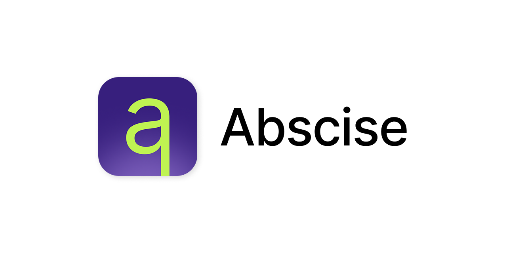
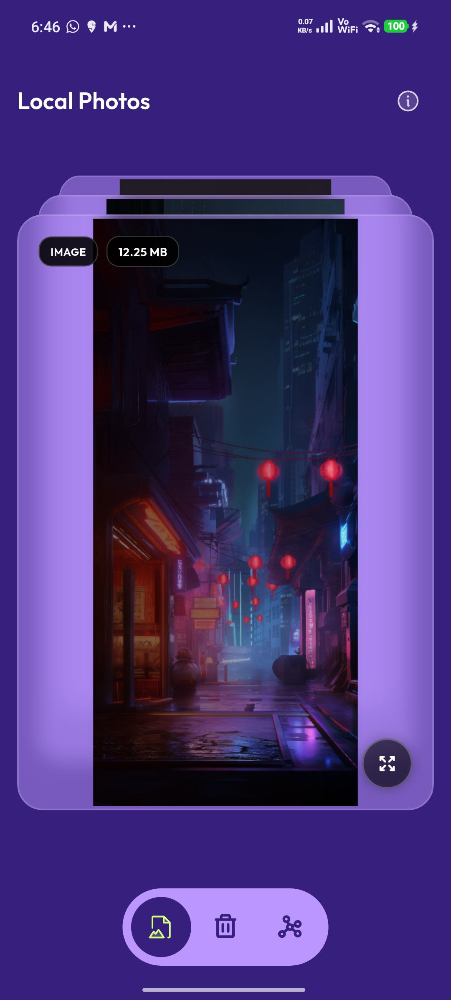
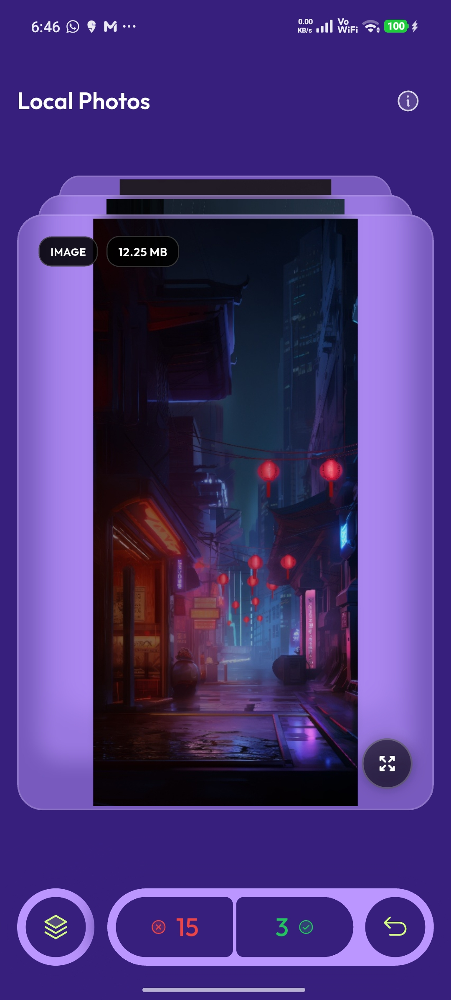
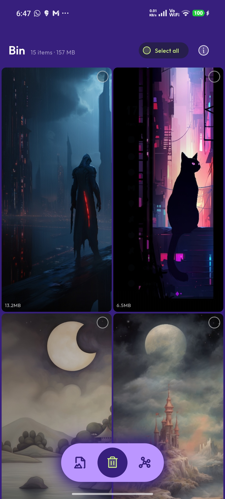
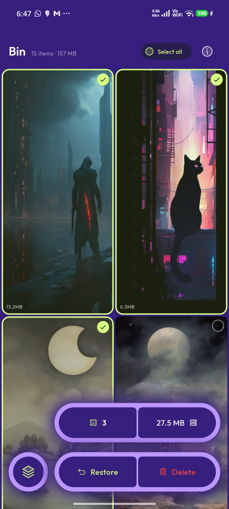
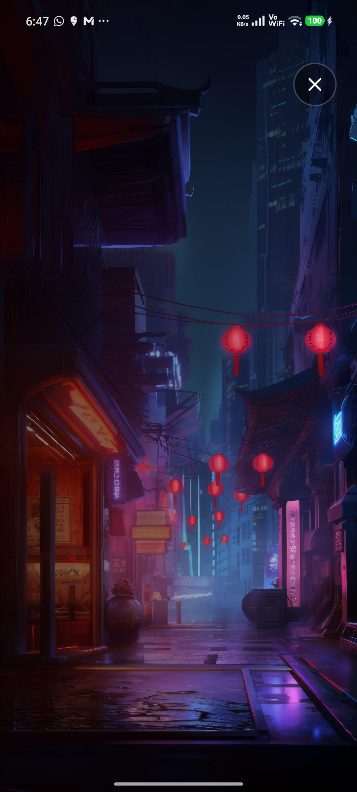
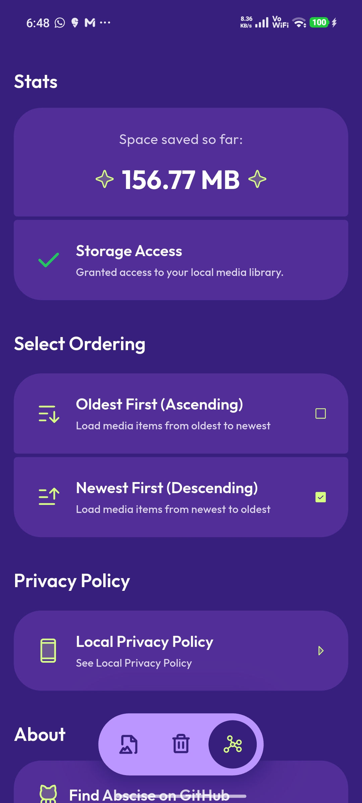

# Abscise - A swipe-based photo cleanup app

<p align="center">
  
</p>

Abscise is a privacy-first, swipe-based media cleanup app for your local photo library. Review your images and videos one-by-one, swipe right to keep them, and swipe left to send clutter to a safe local Bin — without uploading anything to the cloud.

Think of it as a calmer, faster way to sort through the endless gallery backlog and keep only the shots that matter.


---

## ✨ Features

- Swipe through your local photos and videos in a compact interactive deck
- Keep what matters by swiping right
- Send unwanted items to a local Bin instead of deleting immediately
- Review bin items before permanent deletion with explicit confirmation
- Built for mobile-first cleanup sessions with a minimal, focused UI
- Dark-mode-friendly design with a polished gallery experience
- View storage statistics and keep track of how much space you’re reclaiming

---

## 🧭 How it works

1. Grant storage permission so Abscise can read your local media library.
2. Swipe through cards in the deck: keep what you want, bin what you don’t.
3. Open the Bin screen, review the selected clutter, and permanently delete it only after final confirmation.

---

## 📸 Screenshots

<p float="left">
  
  
  
  
  
  
</p>

---

## 📦 Installation

- Go to the [releases](https://github.com/jydv402/abscise/releases/latest) page and download a matching `.apk` file
- Install the app and start swiping...

### Prerequisites

- Flutter SDK 3.11 or newer
- Android device or emulator
- Local media storage access enabled for the app

### Run locally

```bash
git clone https://github.com/jydv402/abscise.git
cd abscise
flutter pub get
flutter run
```

### Build an Android APK

```bash
flutter build apk
```

---

## 🤝 Contributing

Contributions are welcome.

1. Fork the repo
2. Create a feature branch
3. Make your changes
4. Run
   ```bash
   flutter test
   ```
5. Open a pull request

---

## 🛡️ Privacy promise

Abscise is designed to stay local-first. The app requests local storage permission to catalog and manage files in your own device library. It does not upload your media or history to a backend.

- No media bytes are uploaded to a remote server
- The app uses a local Bin before permanent deletion
- Final deletion must still be confirmed through the system permission flow

---

## 📜 License

This project is licensed under the MIT License.

---

## 💬 Support

If Abscise helps you clean up your gallery faster, consider:

- ⭐ Starring the repository
- 🐞 Reporting bugs or feature ideas
- 💡 Sharing the app with someone who wants to save up some storage
